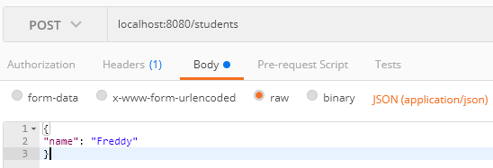
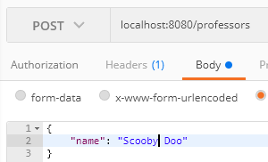
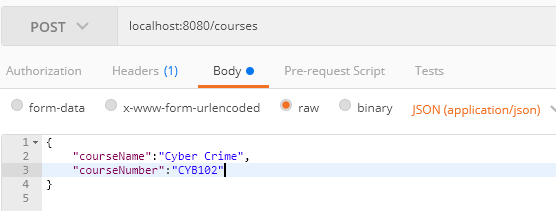
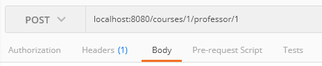
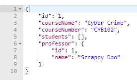
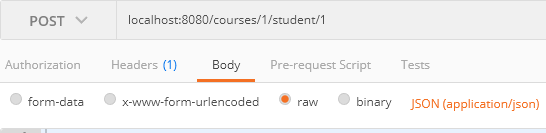
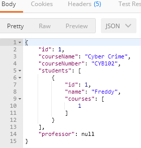

# Course Registration
Course Registration Java SpringBoot API.

**Prerequisites**
* Docker v20.10.10 build b485636

**Running Project**
1. Clone from GitHub.
2. Build Docker image
3. Run docker image

```
git clone git@github.com:largodeivis/class-registration.git
docker build -t class-reg .
docker run -p 8080:8080 class-reg
```

## Calling the API
### Create Student

_Post_ Request to _/students/_ with a request body.

```
localhost:8080/students
```

**Request Body**
```
{
"name": "Freddy"
}
```




### Create Professor

_Post_ Request to _/professors/_ with a request body.

```
localhost:8080/professors
```

**Request Body**
```
{
"name": "Scooby Doo"
}
```



### Create Courses

_Post_ Request to _/courses/_ with a request body. CourseNumbers must be unique.

```
localhost:8080/courses
```

**Request Body**
```
{
	"courseName":"Cyber Crime",
	"courseNumber":"CYB102"
}
```




### Assign a Professor to a Course

_Post_ Request to _/courses/**{courseId}**/professor/**{professorId}**_. 

```
localhost:8080/courses/1/professor/1
```



**Response**




### Register a Student to a Course

_Post_ Request to _/courses/**{courseId}**/student/**{studentId}**_.

```
localhost:8080/courses/1/student/1
```



**Response**




## Load Test Results
* Load tests have been performed using [loadtest](https://github.com/alexfernandez/loadtest).

### Create Professors
* **localhost:8080/professors**

```
{
totalRequests: 5996,
totalErrors: 0,
totalTimeSeconds: 30.0365671,
rps: 200,
meanLatencyMs: 12.4,
maxLatencyMs: 79,
minLatencyMs: 4,
percentiles: { '50': 11, '90': 18, '95': 21, '99': 30 },
errorCodes: {},
instanceIndex: 0
}
```

### Create Students
* **localhost:8080/students**
```
{
totalRequests: 5998,
totalErrors: 0,
totalTimeSeconds: 30.029641599999998,
rps: 200,
meanLatencyMs: 13.8,
maxLatencyMs: 158,
minLatencyMs: 4,
percentiles: { '50': 11, '90': 21, '95': 26, '99': 40 },
errorCodes: {},
instanceIndex: 0
}
```


### Create Courses
* **localhost:8080/courses**

```
{
  totalRequests: 1000,
  totalErrors: 0,
  totalTimeSeconds: 3.4538457,
  rps: 290,
  meanLatencyMs: 2522.3,
  maxLatencyMs: 3376,
  minLatencyMs: 1752,
  percentiles: { '50': 2530, '90': 2963, '95': 3087, '99': 3226 },
  errorCodes: {},
  instanceIndex: 0
}
```


### Assign Professor to Course
* **localhost:8080/courses/{course_id}/professor/{professor_id}**
```
{
  totalRequests: 1000,
  totalErrors: 0,
  totalTimeSeconds: 2.7105786,
  rps: 369,
  meanLatencyMs: 1790.6,
  maxLatencyMs: 2685,
  minLatencyMs: 970,
  percentiles: { '50': 1779, '90': 2387, '95': 2469, '99': 2644 },
  errorCodes: {},
  instanceIndex: 0
}
```

### Register Student to Course
* **localhost:8080/courses/{course_id}/student/{student_id}**
```
{
  totalRequests: 1000,
  totalErrors: 0,
  totalTimeSeconds: 2.5790951,
  rps: 388,
  meanLatencyMs: 1694.6,
  maxLatencyMs: 2518,
  minLatencyMs: 1083,
  percentiles: { '50': 1670, '90': 2140, '95': 2280, '99': 2425 },
  errorCodes: {},
  instanceIndex: 0
}
```

